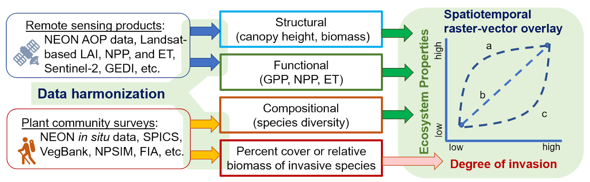

# Home

## Ecosystems Under Invasion

A quest to understand the responses of terrestrial ecosystem properties to variable degrees of invasion. 

{ .homepage-hero }

## Working Group Abstract

Biological invasion severely disrupts ecosystems and human societies by compromising ecosystem services and complicating conservation actions. 
To mitigate invasion impacts with limited resources, understanding ecosystem-scale sensitivity to the degree of invasion is critical for developing effective management plans. 
However, evaluations of ecosystem responses to biological invasions are often limited to simple comparisons between native and invaded communities, thus it remains unclear how ecosystem functions and services change along the gradient of invasion and how these responses vary among ecosystems, dominant invaders, and environmental conditions. 
Our working group will address these questions by integrating diverse environmental data sources from various terrestrial ecosystems using the advanced computational resources available through ESIIL to investigate how ecosystem properties are affected by biological invasion. 
This project will improve our understanding of biological invasion and the assessment of their impacts on ecosystem functioning and services.

## Start Here

1. Replace the title and summary with the working group question, the community or scientific need, and the main outputs the group expects to produce.
2. Add or link the datasets, working documents, and references your group will use.
3. Run or adapt at least one analysis workflow and record decisions in the repository.
4. Commit figures, tables, notes, and summaries so the work is versioned and reproducible.
5. Use the website to share progress, methods, and results with collaborators and community audiences.

[Plan the work](work-plan.md){ .md-button }
[Document data and resources](how-this-group-works.md#data){ .md-button .md-button--secondary }
[Set community expectations](community-care.md){ .md-button .md-button--secondary }

## Working Group Landmarks

Use these lightweight labels to connect work sessions, meeting notes, and homepage edits:

WG-A People and roles; WG-B Question and scope; WG-C Data and access; WG-D Methods and workflows; WG-E Results and synthesis; WG-F Outputs and handoff.

[Use the landmark guide](instructions/working-group-landmarks.md){ .md-button .md-button--secondary }

## How This Repo Is Organized

The repository has two connected layers. Top-level files configure the project and its automation. The `docs/` folder contains the website content. `mkdocs.yml` tells MkDocs how to turn that content into the public site. Analysis folders hold the working scientific materials that generate the results shown on the website.

| Part of the repo | What it does | What usually belongs there |
| --- | --- | --- |
| Top-level files and folders | Configure the project and keep shared repository guidance in one place | `README.md`, `LICENSE`, workflows, containers, templates, environment setup, and repo-wide metadata |
| `docs/` | Stores the source content for the public website | Homepage text, summaries, methods, community-facing documentation, and website assets |
| `mkdocs.yml` | Controls how the site is rendered | Navigation, theme settings, plugins, and GitHub edit links |
| Working folders | Hold the science-in-progress | Data references, notebooks, scripts, workflows, figures, outputs, and reproducibility materials |

## Repository Side: Do the Science

![Placeholder image for the repository side of the workflow][slot-repository-side]{ .slot-button-image }

--8<-- "_generated/slot_notes/repository-side.md"

Related landmarks: WG-C Data and access; WG-D Methods and workflows.

The repository is the working record of the group: it tracks what changed, why it changed, and how results were produced.

- Data sources and metadata
- Notebooks and scripts
- Workflows and reproducible analysis
- Meeting notes and decisions
- Figures, tables, and other outputs

## Website Side: Share the Science

![Placeholder image for the website side of the workflow][slot-website-side]{ .slot-button-image }

--8<-- "_generated/slot_notes/website-side.md"

Related landmarks: WG-E Results and synthesis; WG-F Outputs and handoff.

The website turns the working group record into a readable public report.

- Plain-language summaries
- Methods documentation
- Figures, maps, and visualizations
- Meeting outputs and synthesis products
- Manuscripts, reports, or educational materials

## How the Two Sides Connect

The repository and website are not separate products. When the group updates data, analysis code, figures, or written summaries in GitHub, those changes can be rendered through the website. Commits are the bridge between doing the science and sharing the science.

## When This Working Group Is Live

A working group is live when:

- The research question is stated
- Data sources are linked or documented
- At least one analysis or workflow is runnable
- Outputs are committed to the repository
- The website explains what the group is doing and why it matters

For guidance on turning this scaffold into a public scientific record, see the [Public-Facing Site Guide](public-facing-site-guide.md).

## Early Process Gallery

Use this section to show how the working group gets started without manually editing image links one by one.

--8<-- "_generated/galleries/root/start-here/index.md"

## Key Links to Replace

Use this section for the links your group will actually maintain. Replace each placeholder with the working document, repository resource, dataset hub, or output page that your collaborators should use.

- Main Working Document: [link]
- GitHub Repository: [link]
- Data / Resources: [link]
- Outputs / Dashboard: [link]

## Current Phase

Working Phase: Preparing for Meeting 1  
(Replace this line with the phase your group is actually in, such as working asynchronously, preparing outputs, or revising a manuscript.)

## Team Members

Replace this table with names, roles, institutions, and responsibilities so new collaborators know who is doing what.

Related landmark: WG-A People and roles.

![Placeholder image representing collaboration and group identity][slot-group-photo]{ .section-image }

--8<-- "_generated/slot_notes/group-photo.md"

| Name                   | Role                   | Institution                  | Expertise                                                                                            |
|------------------------|------------------------|------------------------------|------------------------------------------------------------------------------------------------------|
| Yingying Xie           | PI, project lead       | Northern Kentucky University | Plant ecology, biological invasion, environmental data science, statistical modeling, remote sensing |
| Thilina Surasinghe     | Co-PI, project co-lead | Bridgewater State University | measuring biodiversity change, biological invasions, community ecology, GIS, statistical modeling    |
| Diane Styers           | Co-PI                  | Western Carolina University  | Forest ecology, remote sensing, GIS                                                                  |
| Mary Beth Kolozsvary   | Co-PI                  | Siena College                | biodiversity, biological invasions, community ecology                                                |
| Matthew Aiello-Lammens | Tech lead              | Pace University              | Plant ecology, ecological modeling, invasion biology                                                 |
| Chenyang Wei           | Tech co-lead           | The Ohio State Univeristy    | Physical geography, remote sensing, environmental data science                                       |
| Reymond Miyajima       | Participant            | The Ohio State Univeristy    | Trait-based ecology, geospatial statistics, biogeography                                             |
| Claire Lunch           | Participant            | NEON                         | Data science, NEON                                                                                   |
| Nate Hofford           | Participant            | Earth Lab / NC RISCC         | Biological invasions, genomics, data science                                                         |
| Nathan Quarderer       | Participant            | ESIIL                        | data science education                                                                               |
| Chelsea Nagy           | Participant            | NC RISCC                     | Translational science, invasive species, carbon storage, ecosystem structure                         |
| Jeremy Collings        | Participant            | NY Natural Heritage Program  | Statistical modeling, Bayesian statistics, population modeling                                       |

--8<-- "_generated/image_slots.md"
